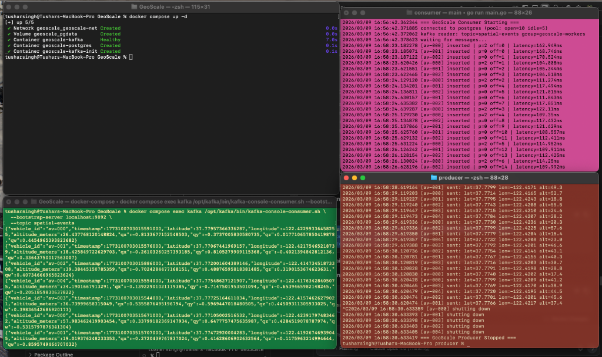
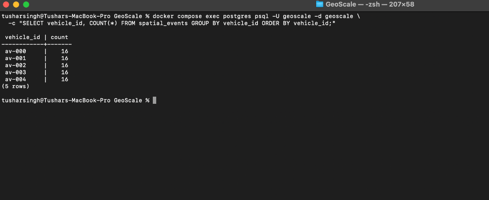

# GeoScale 🌍

I built this distributed 6DoF spatial data ingestion pipeline to learn how real-time streaming systems work at scale. 
It simulates a fleet of autonomous vehicles sending telemetry (GPS + orientation) through Kafka into PostgreSQL.

## Architecture

```
┌──────────────────┐       ┌─────────────────────┐       ┌──────────────────┐
│  Go Producer     │       │  Kafka              │       │  Go Consumers    │
│                  │       │  topic:             │       │  (consumer group │
│  5 goroutines    │──────▶│  spatial-events     │──────▶│  geoscale-workers│
│  (1 per vehicle) │       │                     │       │                  │
│                  │       │  ┌─────────────┐    │       │  Pod 0 ← Part 0 │
│  av-000          │       │  │ Partition 0 │    │       │  Pod 1 ← Part 1 │
│  av-001          │       │  │ Partition 1 │    │       │  Pod 2 ← Part 2 │
│  av-002          │       │  │ Partition 2 │    │       │                  │
│  av-003          │       │  └─────────────┘    │       │  validate →      │
│  av-004          │       │                     │       │  measure latency │
│                  │       │  key=vehicle_id     │       │  insert → PG     │
└──────────────────┘       └─────────────────────┘       └────────┬─────────┘
                                                                  │
                                                                  ▼
                                                         ┌──────────────────┐
                                                         │  PostgreSQL      │
                                                         │  spatial_events  │
                                                         └──────────────────┘
```

## Demo

### Full pipeline running — producer, consumer, and Kafka messages side by side:



### Even data distribution across all vehicles in PostgreSQL:



## Quick Start

### 1. Start the infrastructure
```bash
docker compose up -d
```

### 2. Start the consumer
```bash
cd consumer && go run main.go
```

### 3. Start the producer
```bash
cd producer && go run main.go
```
